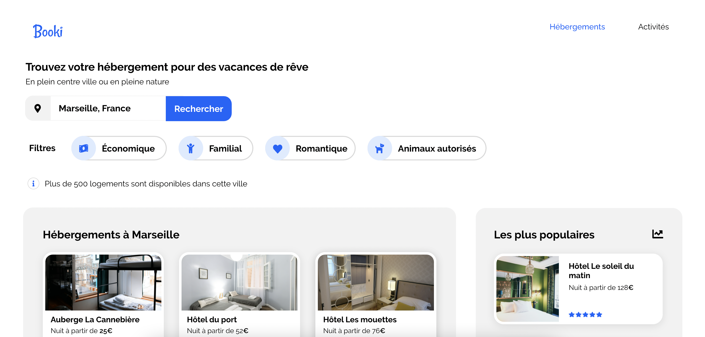

# Booki ☀️✈️
# A Project to learn HTML and CSS

This is my solution to the first project of the OpenClassroom's web developer course (https://openclassrooms.com/fr/). 
This project introduce the basics of HTLM and CSS through the integration of a very specific design they provide.

## Overview

### The challenge

Users should be able to:

- Edit the text in the seach bar. The input need to be in a form and the search function musn't work.
- Click on the whole activities and host cards (not just the title). The links are empty and need to be fill with an #.
- See an hover effect on the search filters. The filter must not work.
- Click on "Hébergements" and "Activities", they need to lead to the host section and the activites section.

You need to : 
- Use 992px as a breakpoint for desktop and 768px for the mobile one.
- Create desktop first, then tablet and mobile at the end.
- Choose the best resolution for your image
- Use flexbox, grid is forbidden
- Use HTML and CSS only, frameworks, bootstrap... are forbidden.
- Check compatibility on every browser

### Screenshot

### Links

- Solution URL: (https://carolinelienard.github.io/booki/)

## My process

### Built with

- HTML5
- CSS 
- Flexbox

### What I learned

This was my very first project. I learned how to use HTML and CSS but also how to use Github. This solution made me work on the basics which was appreciable for a newbie like me.

### Useful resources

- Flexbox Froggy 🐸 (https://flexboxfroggy.com/#fr) - A perfect game to be more familiar with flexbox
- HTML de zéro (https://www.youtube.com/watch?v=qsbkZ7gIKnc&t=0s&ab_channel=FromScratch-D%C3%A9veloppementWeb) - An amazing french tutorial for HTML and CSS, really complete.

## Author

- Caroline Lienard (https://github.com/CarolineLienard)
- OpenClassroom - (https://openclassrooms.com/fr/)

#### Note: If you are student, do your best to create your own solution, you got this 👍🏻
